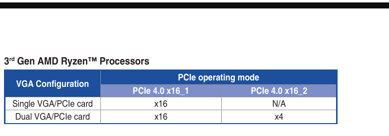
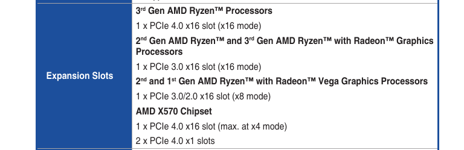
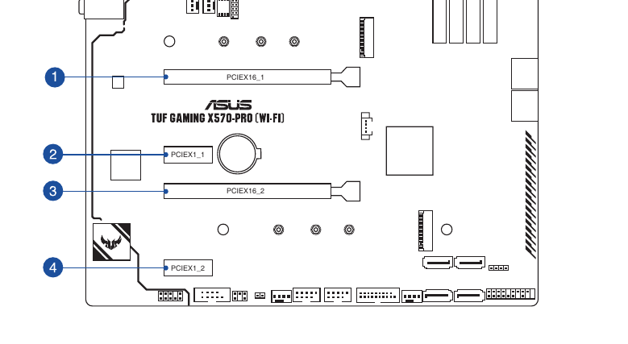

# Introducción

En este bloque, simularemos un escenario en el que nos hemos comprado una GPU nueva, la hemos conectado a nuestro ordenador. Usaremos varios scripts útiles para ver si está correctamente parametrizada.

# Prerequisitos

Si quieres ejecutar estos scripts, tu sistema operativo debe ser un Linux o derivado. Desde tu gestor de paquetes instala los siguientes paquetes:

- hwloc
- pciutils
- dmidecode

> Alternativamente 

Ejemplo para Ubuntu:

```bash
sudo apt install hwloc pciutils dmidecode
```

# Identificar slot de PCIe (PCI Express) donde vamos a conectar la GPU

Para este ejemplo, te muestro varias imágenes del manual de mi placa, para ilustrar el dondé tengo
que instalar físicamente una nueva GPU. 

> Esta información evidentemente variará en función tanto de la GPU como la placa base (motherboard) de que dispongas. Si dispones de un portátil, generalmente ya vienen con una GPU o iGPU instalada.






En este caso, seleccionaré el puerto **PCIEx16_1** para conectar físicamente la CPU.


# Cómo saber cómo está conectado nuestro hardware internamente

```bash
[localhost:~/repo/conoce_tu_hardware]$ cat cpu_io_topo.sh 
#!/usr/bin/env bash
lstopo --output-format svg --whole-io -v > cpu.svg

[localhost:~/repo/conoce_tu_hardware]$ ./cpu_io_topo.sh
```
## Descripción

Este comando creará una imagen llamada **cpu.svg**, que corresponde a un diagrama donde podremos visualizar cómo está conectada nuestra CPU a distintos dispositivos por medio de los buses PCI.

[Explicación detallada del comando](https://www.explainshell.com/explain?cmd=lstopo+--output-format+svg+--whole-io+-v+%3E+cpu.svg)


En la imagen podemos ver que el puerto donde he instalado la GPU, mi sistema operativo le ha asignado el puerto PCIE: **04:00.0**. 

**¡OJO!**: No confundir el identificador que viene con la placa base (**PCIEx16_1**), con el que luego asigna el sistema operativo (**04:00.0**.).


> La imagen es orientativa. Evidentemente cambiará en función del equipo en el que se ejecute.


# Cómo obtener información de la GPU a partir de bus PCI

Basándonos en la imagen de este ejemplo, podemos identificar que el bus PCI que queremos consultar, para que nos de más información sobre nuestra GPU, es el **04:00.0**. Lo anotamos, ya que será necesario para ejecutar el siguiente comando:


```bash
[localhost:~/repo/conoce_tu_hardware]$ cat pci_simple.sh 
#!/usr/bin/env bash
lspci -vmm -s $1


[localhost:~/repo/conoce_tu_hardware]$ ./pci_simple.sh 04:00.0
Slot:   04:00.0
Class:  VGA compatible controller
Vendor: NVIDIA Corporation
Device: AD106 [GeForce RTX 4060 Ti 16GB]
SVendor:        ASUSTeK Computer Inc.
SDevice:        Device 891b
Rev:    a1
ProgIf: 00
IOMMUGroup:     18
```

Este comando nos da información básica de nuestra GPU. 

Si queremos tener información más detallada, ejecutaremos como administrador (root) el siguiente comando:

```bash
[localhost:~/repo/conoce_tu_hardware]$ cat ./pci_deep.sh 
#!/usr/bin/env bash
lspci -nn -vvv -s $1

[localhost:~/repo/conoce_tu_hardware]$ sudo ./pci_deep.sh 04:00.0
[sudo] password for user: 
04:00.0 VGA compatible controller [0300]: NVIDIA Corporation AD106 [GeForce RTX 4060 Ti 16GB] [10de:2805] (rev a1) (prog-if 00 [VGA controller])
        Subsystem: ASUSTeK Computer Inc. Device [1043:891b]
        Control: I/O+ Mem+ BusMaster+ SpecCycle- MemWINV- VGASnoop- ParErr- Stepping- SERR- FastB2B- DisINTx+
        Status: Cap+ 66MHz- UDF- FastB2B- ParErr- DEVSEL=fast >TAbort- <TAbort- <MAbort- >SERR- <PERR- INTx-
        Latency: 0
        Interrupt: pin A routed to IRQ 156
        IOMMU group: 18
        Region 0: Memory at fa000000 (32-bit, non-prefetchable) [size=16M]
        Region 1: Memory at 7800000000 (64-bit, prefetchable) [size=16G]
        Region 3: Memory at 7c00000000 (64-bit, prefetchable) [size=32M]
        Region 5: I/O ports at f000 [size=128]
        Expansion ROM at fb000000 [virtual] [disabled] [size=512K]
        Capabilities: [60] Power Management version 3
                Flags: PMEClk- DSI- D1- D2- AuxCurrent=0mA PME(D0+,D1-,D2-,D3hot+,D3cold-)
                Status: D0 NoSoftRst+ PME-Enable- DSel=0 DScale=0 PME-
        Capabilities: [68] MSI: Enable+ Count=1/1 Maskable- 64bit+
                Address: 00000000fee00000  Data: 0000
        Capabilities: [78] Express (v2) Legacy Endpoint, IntMsgNum 0
                DevCap: MaxPayload 256 bytes, PhantFunc 0, Latency L0s unlimited, L1 <64us
                        ExtTag+ AttnBtn- AttnInd- PwrInd- RBE+ FLReset+ TEE-IO-
                DevCtl: CorrErr- NonFatalErr- FatalErr- UnsupReq-
                        RlxdOrd+ ExtTag+ PhantFunc- AuxPwr- NoSnoop+ FLReset-
                        MaxPayload 128 bytes, MaxReadReq 512 bytes
                DevSta: CorrErr- NonFatalErr- FatalErr- UnsupReq- AuxPwr- TransPend-
                LnkCap: Port #0, Speed 16GT/s, Width x8, ASPM L1, Exit Latency L1 <16us
                        ClockPM+ Surprise- LLActRep- BwNot- ASPMOptComp+
                LnkCtl: ASPM L1 Enabled; RCB 64 bytes, LnkDisable- CommClk+
                        ExtSynch- ClockPM+ AutWidDis- BWInt- AutBWInt-
                LnkSta: Speed 2.5GT/s (downgraded), Width x4 (downgraded)
                        TrErr- Train- SlotClk+ DLActive- BWMgmt- ABWMgmt-
                DevCap2: Completion Timeout: Range AB, TimeoutDis+ NROPrPrP- LTR+
                         10BitTagComp+ 10BitTagReq+ OBFF Via message, ExtFmt- EETLPPrefix-
                         EmergencyPowerReduction Not Supported, EmergencyPowerReductionInit-
                         FRS-
                         AtomicOpsCap: 32bit- 64bit- 128bitCAS-
                DevCtl2: Completion Timeout: 50us to 50ms, TimeoutDis-
                         AtomicOpsCtl: ReqEn-
                         IDOReq- IDOCompl- LTR+ EmergencyPowerReductionReq-
                         10BitTagReq- OBFF Disabled, EETLPPrefixBlk-
                LnkCap2: Supported Link Speeds: 2.5-16GT/s, Crosslink- Retimer+ 2Retimers+ DRS-
                LnkCtl2: Target Link Speed: 16GT/s, EnterCompliance- SpeedDis-
                         Transmit Margin: Normal Operating Range, EnterModifiedCompliance- ComplianceSOS-
                         Compliance Preset/De-emphasis: -6dB de-emphasis, 0dB preshoot
                LnkSta2: Current De-emphasis Level: -3.5dB, EqualizationComplete+ EqualizationPhase1+
                         EqualizationPhase2+ EqualizationPhase3+ LinkEqualizationRequest-
                         Retimer- 2Retimers- CrosslinkRes: unsupported
        Capabilities: [b4] Vendor Specific Information: Len=14 <?>
        Capabilities: [100 v1] Virtual Channel
                Caps:   LPEVC=0 RefClk=100ns PATEntryBits=1
                Arb:    Fixed- WRR32- WRR64- WRR128-
                Ctrl:   ArbSelect=Fixed
                Status: InProgress-
                VC0:    Caps:   PATOffset=00 MaxTimeSlots=1 RejSnoopTrans-
                        Arb:    Fixed- WRR32- WRR64- WRR128- TWRR128- WRR256-
                        Ctrl:   Enable+ ID=0 ArbSelect=Fixed TC/VC=01
                        Status: NegoPending- InProgress-
        Capabilities: [250 v1] Latency Tolerance Reporting
                Max snoop latency: 34326183936ns
                Max no snoop latency: 34326183936ns
        Capabilities: [258 v1] L1 PM Substates
                L1SubCap: PCI-PM_L1.2+ PCI-PM_L1.1+ ASPM_L1.2- ASPM_L1.1+ L1_PM_Substates+
                          PortCommonModeRestoreTime=255us PortTPowerOnTime=10us
                L1SubCtl1: PCI-PM_L1.2- PCI-PM_L1.1- ASPM_L1.2- ASPM_L1.1-
                           T_CommonMode=0us
                L1SubCtl2: T_PwrOn=10us
        Capabilities: [128 v1] Power Budgeting <?>
        Capabilities: [420 v2] Advanced Error Reporting
                UESta:  DLP- SDES- TLP- FCP- CmpltTO- CmpltAbrt- UnxCmplt- RxOF- MalfTLP- ECRC- UnsupReq- ACSViol-
                UEMsk:  DLP- SDES- TLP- FCP- CmpltTO- CmpltAbrt- UnxCmplt- RxOF- MalfTLP- ECRC- UnsupReq- ACSViol-
                UESvrt: DLP+ SDES+ TLP- FCP+ CmpltTO- CmpltAbrt- UnxCmplt- RxOF+ MalfTLP+ ECRC- UnsupReq- ACSViol-
                CESta:  RxErr- BadTLP- BadDLLP- Rollover- Timeout- AdvNonFatalErr-
                CEMsk:  RxErr- BadTLP- BadDLLP- Rollover- Timeout- AdvNonFatalErr+
                AERCap: First Error Pointer: 00, ECRCGenCap- ECRCGenEn- ECRCChkCap- ECRCChkEn-
                        MultHdrRecCap- MultHdrRecEn- TLPPfxPres- HdrLogCap-
                HeaderLog: 00000000 00000000 00000000 00000000
        Capabilities: [600 v1] Vendor Specific Information: ID=0001 Rev=1 Len=024 <?>
        Capabilities: [900 v1] Secondary PCI Express
                LnkCtl3: LnkEquIntrruptEn- PerformEqu-
                LaneErrStat: 0
        Capabilities: [bb0 v1] Physical Resizable BAR
                BAR 0: current size: 16MB, supported: 16MB
                BAR 1: current size: 16GB, supported: 64MB 128MB 256MB 512MB 1GB 2GB 4GB 8GB 16GB
                BAR 3: current size: 32MB, supported: 32MB
        Capabilities: [c1c v1] Physical Layer 16.0 GT/s <?>
        Capabilities: [d00 v1] Lane Margining at the Receiver
                PortCap: Uses Driver+
                PortSta: MargReady- MargSoftReady-
        Capabilities: [e00 v1] Data Link Feature <?>
        Kernel driver in use: nvidia
libkmod: kmod_config_parse: /etc/modprobe.d/nixos.conf line 8: ignoring bad line starting with 'options'
        Kernel modules: nvidiafb, nouveau, nvidia_drm, nvidia

```

Si nos fijamos, en la sección de **Capabilities**, en concreto en las claves **LnkCap** y **LnkSta** , podremos ver a qué velocidad está configurada la GPU:

```bash
...
...
                LnkCap: Port #0, Speed 16GT/s, Width x8, ASPM L1, Exit Latency L1 <16us
                        ClockPM+ Surprise- LLActRep- BwNot- ASPMOptComp+

...
...
                LnkSta: Speed 2.5GT/s (downgraded), Width x4 (downgraded)
                        TrErr- Train- SlotClk+ DLActive- BWMgmt- ABWMgmt-

```

Como podemos observar, la capacidad de la GPU (velocidad) es muy superior al estado (LnkSta) está en ese momento. ¿Qué esta pasando?

**Respuesta corta**: El driver de NVDIA en este caso, gestiona la energía, y cuando no hay demanda auto configura el puerto para que consuma menos. 

Si volvieramos a ejecutar este comando, cuando la GPU está realizando alguna inferencia con un LLM, veremos que el **LinkSta* se pone al máximo de capacidad.

[Más información](https://billauer.co.il/blog/2018/08/nvidia-low-pci-express-speed/), para que tenga curiosidad, porque esta es una cosa que suele despistar.
